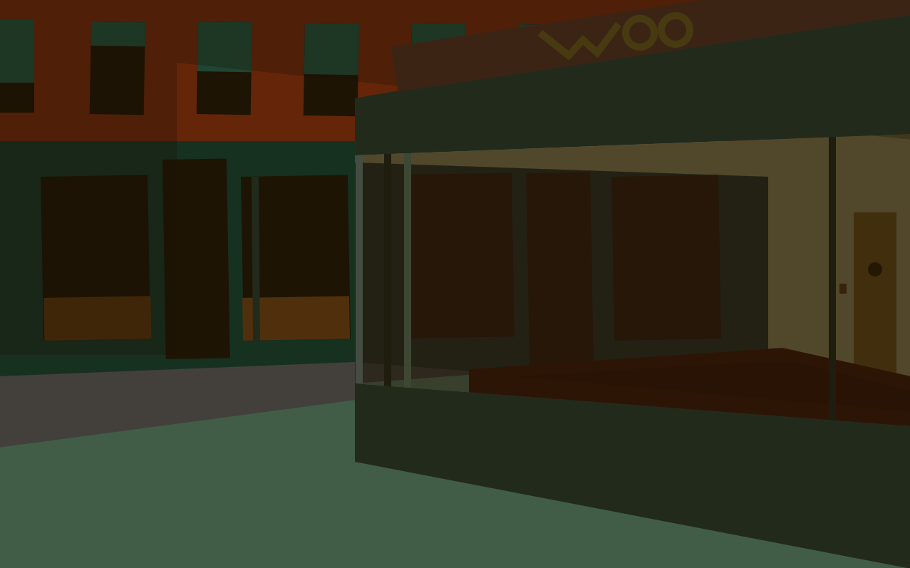
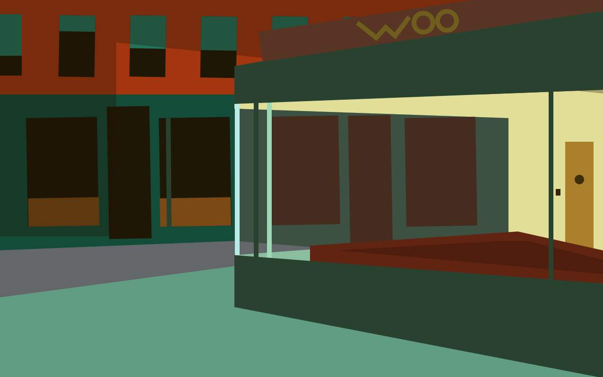

Assignment 1 - Hello World: GitHub and d3  
Morgan Vasiliou 1/22/26
===

**Demo Link**  

**Description**  
This assignment required adding primitives including rectangles, circles, lines, polygons, and paths using D3 SVGs. I chose to add these elements by recreating the basic structure of the painting "Nighthawks" by Edward Hopper. I used rectangles and polygons for many of the large structures in the painting (e.g. rectangles for the windows across the street, polygons for the walls of the restaurant). I added lines to connect the walls of the restaurant together. For the "WOO" on the sign above the restaurant, I used a path for the W and two circles for the Os. I also added a lightswitch on the inside wall of the restaurant that, when clicked, "turns off" the lights.

When you click the lightswitch again, it turns the lights back on.

**Technical achievements**  
Adding a function that turns the lights on and off.

**Design achievements**  
Recreating "Nighthawks" using layering of elements and hexcodes to get colors close to original painting.

**Sources**  
https://d3js.org/getting-started (Used as a reference for appending SVGs.)  
https://d3js.org/d3-selection/events (Used as a reference for the "on" attribute.)  
https://www.w3schools.com/graphics/svg_polygon.asp (Used for attributes of primitives.)  
https://www.codecademy.com/enrolled/courses/introduction-to-javascript (Used for general javascript code & if,then code.)  
https://chatgpt.com/ (Used for guidance on how to append the SVG node at the end & for wrapping the file in HTML.)
